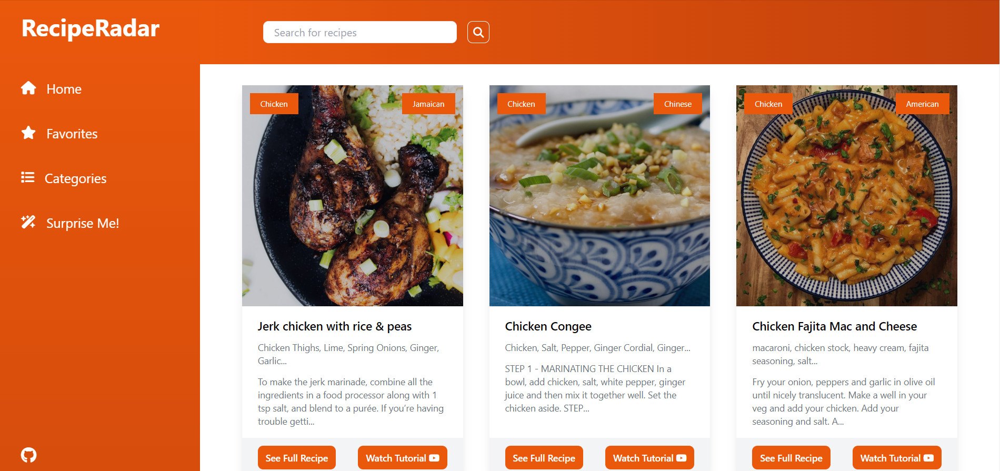
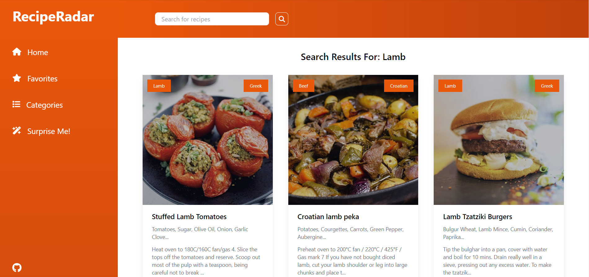
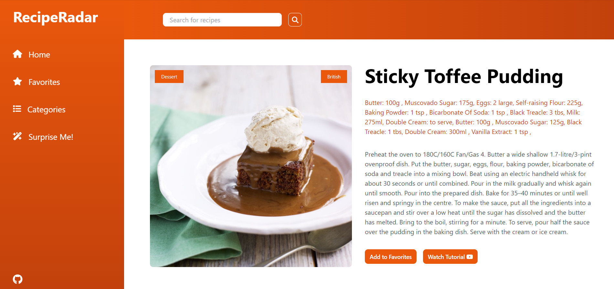
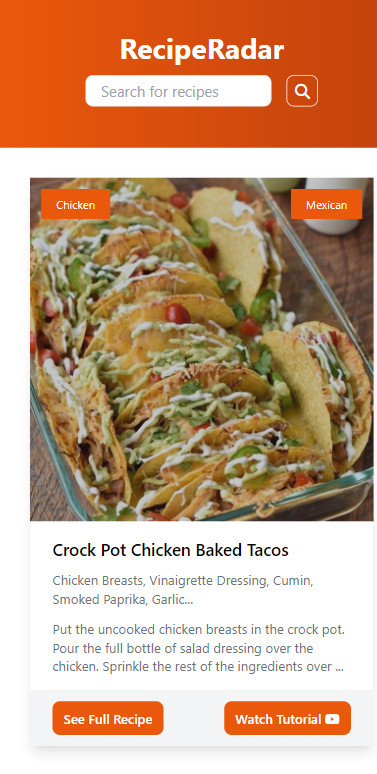

# RecipeRadar

## Overview

RecipeRadar is a comprehensive web application developed as part of the Per Scholas Software Engineering Program. It enables users to explore, search, and interact with a wide range of recipes from various cuisines. Utilizing modern web technologies, RecipeRadar provides an interactive experience where users can discover new recipes, manage favorites, and access detailed cooking instructions.

## Features

- **Interactive Search**: Users can search for recipes by name, ingredients, or categories.
- **Favorites Management**: Ability to save and retrieve favorite recipes for easy access.
- **Dynamic Content Display**: Recipes are dynamically loaded and displayed on the interface, allowing users to browse through different categories and recommendations.
- **Recipe Details**: Detailed view of each recipe including ingredients, instructions, and video tutorials.

## Technologies Used

- HTML5
- Tailwind CSS
- JavaScript
- Font Awesome for icons
- Fetch API for handling HTTP requests to `TheMealDB` API

## User Stories

- **As a user**, I want to search for recipes so that I can find specific dishes to prepare.
- **As a user**, I want to save my favorite recipes so that I can quickly access them later.
- **As a user**, I want to see detailed instructions and ingredients for recipes to ensure I can follow along and cook dishes accurately.
- **As a user**, I want to discover new recipes through random suggestions to expand my culinary skills and tastes.

## Screenshots

\
_Home page showing the initial set of recipes._

\
_Search results displaying recipes based on user queries._

\
_Detailed view of a recipe including ingredients and cooking steps._

\
_Mobile view of the application for easy access on smaller devices._

## Live Site

Visit the live version of RecipeRadar here: [RecipeRadar](reciperadar-js.vercel.app)

## Installation

To run RecipeRadar locally:

1. Clone the repository:

   ```bash
   git clone <repository-url>
   ```

2. Open the project directory:

   ```bash
   cd <project-directory>
   ```

3. No server setup is required. Open index.html in a modern web browser to start using the application.

## Usage

- **Home**: Displays the initial set of recipes.
- **Search**: Allows you to search for recipes based on specific criteria.
- **Categories**: Browse recipes by their categories.
- **Favorites**: View and manage your favorite recipes.
- **Surprise Me!**: Get random recipe suggestions.
